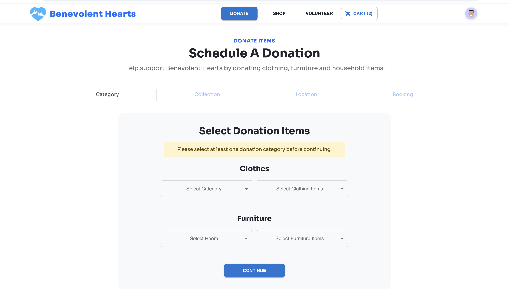
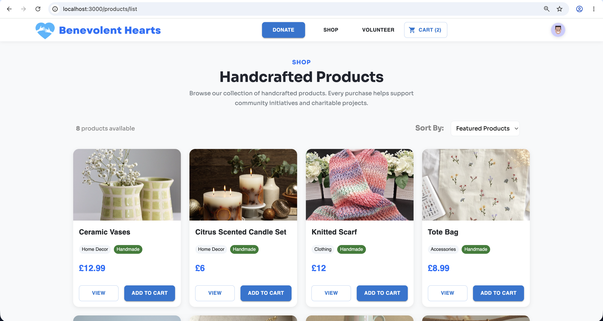
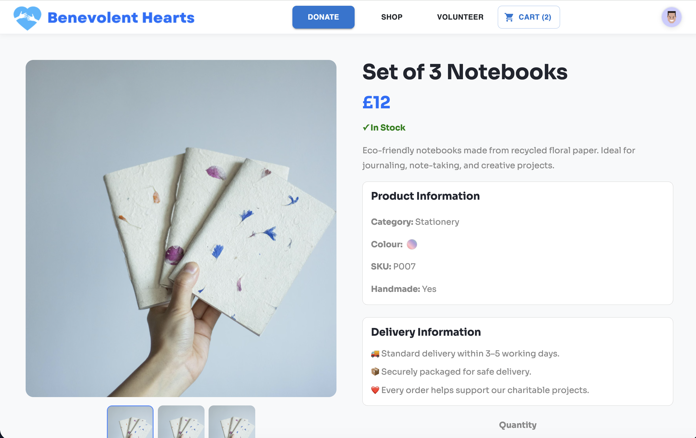
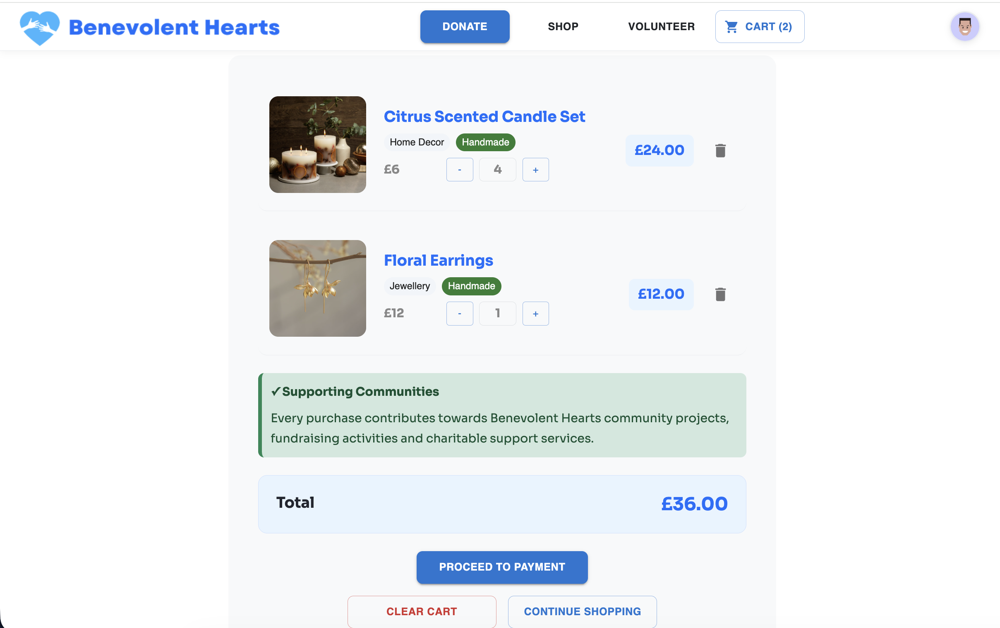
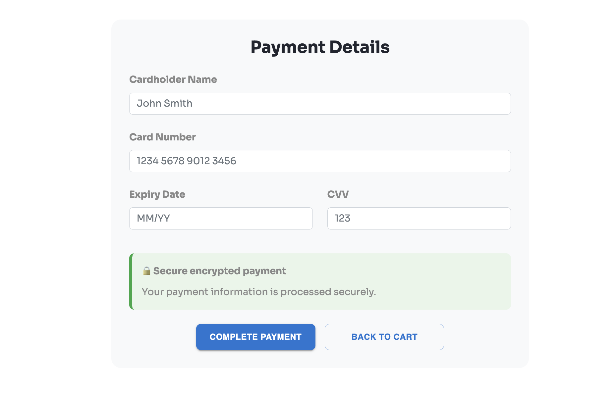
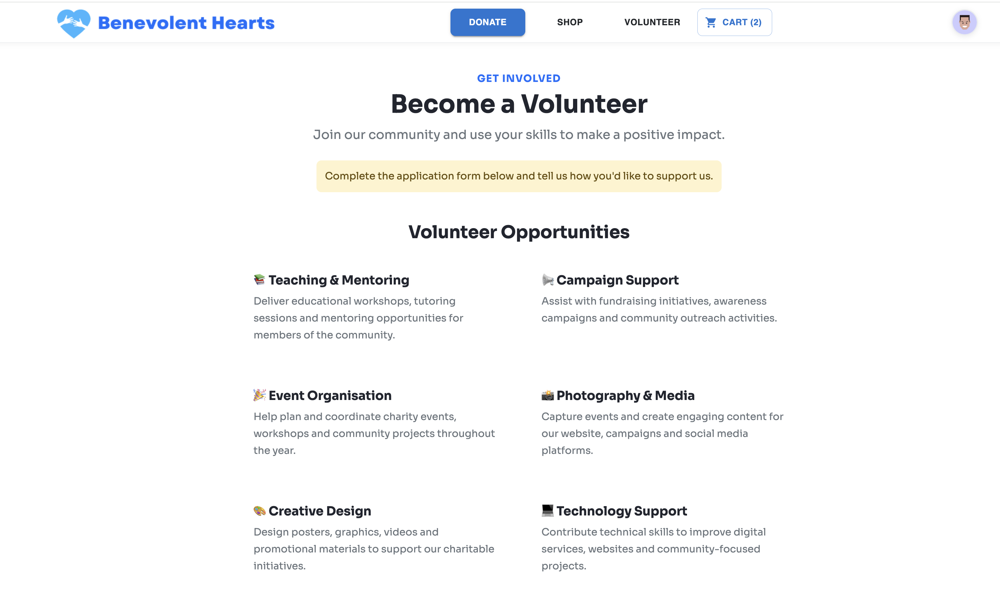
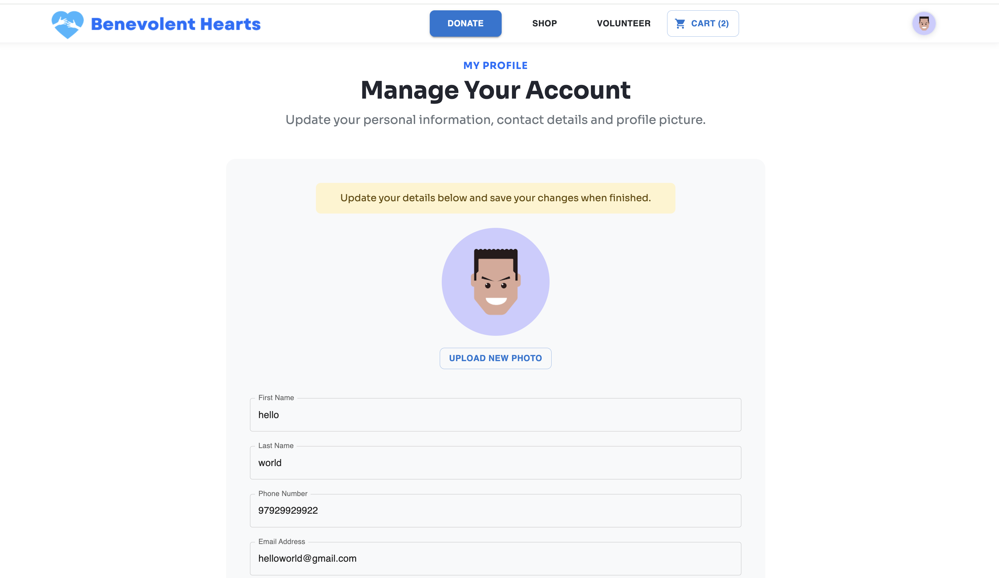

# Benevolent Hearts Charity Platform

## Overview

Benevolent Hearts is a full-stack charity platform developed using React, Node.js, Express, MongoDB Atlas, and Cloudinary. The application is deployed using Netlify and Render, enabling users to support charitable initiatives through donations, volunteering opportunities, and the purchase of handmade products. The application enables users to support charitable initiatives through donations, volunteering opportunities, and the purchase of handmade products.

The platform is divided into three core areas:

### Donations

Users can learn about the organisation's charitable initiatives, fundraising campaigns, and available services. The platform provides donation enquiry and contact forms that allow users to engage directly with the organisation.

### Volunteering

Users can explore volunteer opportunities and submit volunteer applications. This section encourages community involvement by allowing individuals to contribute their time, skills, and experience to support charitable projects and events.

### Charity Shop

The charity shop provides a complete e-commerce experience where users can browse handmade products, view detailed product information, manage a shopping cart, and complete the checkout process. Revenue generated through product sales helps fund Benevolent Hearts community initiatives.

Together, these areas provide a single platform that combines community engagement, charitable support, and fundraising activities.

---

## Features

### User Accounts

Users can:

- Register for a new account
- Upload a profile picture
- Log in and log out securely
- View and update profile information
- Change account details and password
- Show or hide password fields during authentication
- Upload and manage profile pictures using Cloudinary

### Product Catalogue

Users can:

- Browse a collection of handmade charity products
- View detailed product information
- Explore related products
- View product categories and descriptions
- Add products to their shopping cart

### Shopping Cart

Users can:

- Add products to their cart
- Adjust product quantities
- Remove items from the cart
- View order totals before checkout

### Checkout System

The checkout process includes:

- Delivery address selection
- Payment information validation
- Order summary review
- Secure checkout flow
- Order confirmation page

### Volunteer Applications

Visitors can:

- Browse volunteer opportunities
- Submit volunteer applications
- Select areas of interest
- Provide supporting information and experience

### Donations & Contact Forms

Users can:

- Submit donation enquiries
- Contact the organisation directly
- Send general enquiries
- Request information about volunteering and fundraising

### Authentication & Security

- JWT-based authentication
- Protected routes for authenticated users
- Password hashing using Bcrypt.js
- User profile management

### Responsive Design

The application supports:

- Desktop devices
- Tablets
- Mobile devices

---

## Technologies

### Frontend

- React
- React Router DOM
- Material UI (MUI)
- MDB React UI Kit
- Bootstrap
- Styled Components
- JavaScript (ES6)
- HTML5
- CSS3

### Backend

- Node.js
- Express.js
- MongoDB Atlas
- Mongoose
- JWT Authentication
- Passport JWT
- Bcrypt.js
- Cloudinary
- Express Form Data

### Other Tools

- Fetch API
- Context API
- Local Storage
- Git & GitHub
- Netlify (Frontend Deployment)
- Render (Backend Deployment)

---

## Project Structure

```text
benevolent-hearts/
│
├── frontend/
│   │
│   ├── public/
│   │   ├── img/
│   │   ├── _redirects
│   │   └── index.html
│   │
│   ├── src/
│   │   ├── components/
│   │   │   ├── Campaign.jsx
│   │   │   ├── CartContext.jsx
│   │   │   ├── Contact.jsx
│   │   │   ├── DateandTime.jsx
│   │   │   ├── Dropdown.jsx
│   │   │   ├── Footer.jsx
│   │   │   ├── GetLocation.jsx
│   │   │   ├── GuestLayoutRoute.jsx
│   │   │   ├── Hero.jsx
│   │   │   ├── LayoutRoute.jsx
│   │   │   ├── LocationTab.jsx
│   │   │   ├── NavBar.jsx
│   │   │   ├── PrivateLayoutRoute.jsx
│   │   │   ├── ProductCard.jsx
│   │   │   ├── ScrollToTop.jsx
│   │   │   ├── UserContext.jsx
│   │   │   └── ...
│   │   │
│   │   ├── pages/
│   │   │   ├── HomeScreen.jsx
│   │   │   ├── DonateScreen.jsx
│   │   │   ├── VolunteerScreen.jsx
│   │   │   ├── RegistrationScreen.jsx
│   │   │   ├── LoginScreen.jsx
│   │   │   ├── ProfileScreen.jsx
│   │   │   ├── ProductListScreen.jsx
│   │   │   ├── ProductScreen.jsx
│   │   │   ├── CartScreen.jsx
│   │   │   ├── CheckoutScreen.jsx
│   │   │   ├── OrderSuccessScreen.jsx
│   │   │   └── ErrorScreen.jsx
│   │   │
│   │   ├── App.jsx
│   │   ├── index.js
│   │   └── index.css
│   │
│   ├── package.json
│   └── package-lock.json
│
├── backend/
│   │
│   ├── models/
│   │   ├── ProductModel.js
│   │   └── UserModel.js
│   │
│   ├── routes/
│   │   ├── products-routes.js
│   │   └── users-routes.js
│   │
│   ├── create-products.js
│   ├── server.js
│   ├── package.json
│   └── package-lock.json
│
├── screenshots/
│
└── README.md
```

---

## Installation and Setup

### Prerequisites

- Node.js
- npm
- MongoDB Atlas Account
- Cloudinary Account

### Clone the Repository

```bash
git clone https://github.com/Salmah1/Benevolent-Hearts-React-App.git

cd Benevolent-Hearts
```

### Install Dependencies

Frontend:

```bash
cd frontend
npm install
```

Backend:

```bash
cd backend
npm install
```

### Environment Variables

Create a `.env` file in the frontend folder:

```env
REACT_APP_BACKEND_ENDPOINT=http://localhost:3001
```

Create a `.env` file in the backend folder:

```env
DB_URL=your_mongodb_atlas_connection_string
JWT_SECRET=your_secret_key
CLOUDINARY_CLOUD_NAME=your_cloud_name
CLOUDINARY_API_KEY=your_api_key
CLOUDINARY_API_SECRET=your_api_secret
PORT=3001
```

### Running the Project

Start the frontend:

```bash
cd frontend
npm run start-dev
```

Start the backend:

```bash
cd backend
npm start
```

The application will be available at:

```text
http://localhost:3000
```

---

## Screenshots

### Home Page

Main landing page featuring services, campaigns, and contact information.


### Donation Page

View information about charitable giving and submit donation enquiries to support Benevolent Hearts initiatives.



### Product Catalogue

Browse handmade products that support charitable initiatives.



### Product Details

Detailed product information with quantity selection and related products.



### Shopping Cart

Review selected products before checkout.



### Checkout Page

Secure payment and delivery information.



### Volunteer Application

Apply to become a volunteer and support community projects.



### User Profile

Manage account information and profile details.


